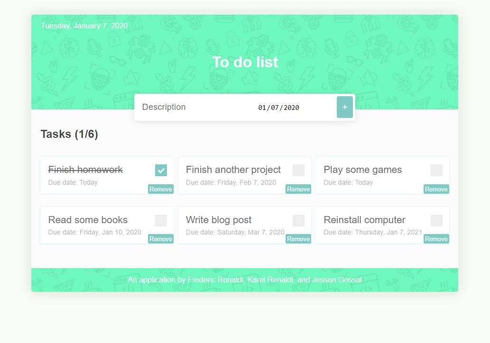

# Tugas Day 3 ARC



1. Technologi Stack

- Express
- MongoDB
- Pug template engine
- CSS

2. How to run

> Install Dependencies

```
npm install
```

> Run server

```
npm run start
```

The website lives in http://localhost:8000/ by default.
If you plan to change the port or deploy for production, please edit config.js to match yours.

> Run ESLint (optional)

```
eslint .
```
